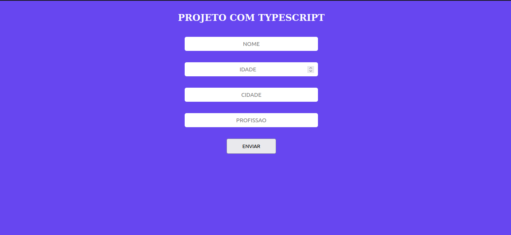

# Projeto Pessoa com Typescript

## O que foi ultilizando nesse projeto
>   * HTML
>   * CSS
>   * NODE
>   * Typescript

## O que foi Feito nesse projeto

> O projeto ele é simples ultilizando Typescript, ele 
> tem como Objetivo cadastrar uma pessoa(nome, idade, 
> cidade, profissao que é opcional), também fiz algumas 
> validados, em alguns campos projetinho.

## Imagem do projeto

## Meus repositórios

> [developer_Allyson](https://github.com/Allysonfreitas210695?tab=repositories).